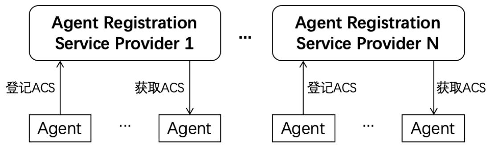

# ACS：智能体能力描述（ACPs-spec-ACS-v01.00-draft-0001）
## 1. 文档定义
本文档为支持智能体互联网[1]的ACPs智能体协作协议族[2]中的智能体能力描述（Agent Capability Specification，ACS）标准定义，版本号v01.00。

本文档为规范征求意见草稿（draft）第0001版，ACPs协议族修订参与单位可针对此征求意见草稿提出意见和建议，经讨论后将形成后续版本。

文档全称为ACPs-spec-ACS-v01.00-draft-0001（ACPs协议族规范-ACS-01.00版本-征求意见草稿第0001版）。

文档编写者：禹可（北京邮电大学），刘军（北京邮电大学），郭小练（北京邮电大学），李胤铭（北京邮电大学），宋昊哲（北京邮电大学）。【注：欢迎业界同仁提出意见和建议，所有贡献者均列入文档编写者列表】

## 2. 智能体能力描述介绍及相关流程
智能体互联网[1]要形成能支撑智能体互相协作的网络基础设施，需要具备的一个重要能力是支持智能体描述自身的能力并进行保存和支持获取。智能体能力描述方式既要保证一定的规范性以便于智能体之间互联互通，也需要具备一定的灵活性以适应基于大模型的智能体复杂能力表述。为达到以上目标，我们在本文档中定义智能体能力描述（Agent Capability Specification，ACS）规范。

每个智能体应为自己生成一个的ACS，并登记在自己注册的智能体注册服务商（Agent Registration Service Provider，ARSP）中。智能体注册服务商可以将智能体登记的ACS提供给其他智能体以支持智能体能力查询。智能体登记和获取ACS的流程如下图所示。



如图所示，每个智能体可以根据自身需要，选择不同的智能体注册服务商（ARSP）进行ACS登记。也可以根据自身需要，选择不同的智能体注册服务商（ARSP）查询其他智能体的ACS。

注：除以上通过ARSP获取ACS外，智能体也可以将自己的ACS文件放置于自身服务访问地址下，以Well Known的方式支持其他使用者直接获取，例如https://agent.example.com/agent_spec.json。不过需要特别指出的是，使用者采用该方式获取智能体能力描述，是一种不安全的方式，我们更建议通过ARSP方式获取。

## 3. 智能体能力描述定义
ACPs的智能体能力描述定义（ACS）采用json格式表述，该定义采用简洁的方式对智能体能力进行具备一定灵活性的表述，以适应新技术趋势下大模型加持的智能体灵活的能力表现，同时又保持协议应具备的明确性。定义格式具体如下：
```json
{
    //基础信息
    "AIC": "", // 智能体身份码（32位数字）[3]
    "name": "", // 智能体名称（字符串）
    "description": "", // 智能体描述（字符串）
    "url": "", // 智能体服务访问地址（URL格式）
    "version": "", // 智能体版本号（字符串）
    "registrationTime": "", // 注册时间（ISO 8601）
    "lastModifiedTime": "", // 最后修改时间（ISO 8601）
    "status": "", // 状态（包括以下2种active/inactive）
    // 智能体提供商信息
    "provider": {
        "name": "", // 智能体提供商名称（字符串）
        "url": "", // 智能体提供商网站地址（URL）
        "license": "" // 智能体提供商网站的备案号
    },
    "authentication": "", // 当前支持的身份认证方式（字符串）
    // 智能体技能列表信息
    "skills": [
        // 某个技能描述
        {
            "id": "", // 技能ID
            "name": "", // 技能名称（字符串）
            "description": "", // 技能描述（字符串）
            "tags": [], // 技能标签（字符串）
            "version": "", // 技能版本号（字符串）
            "lastModifiedTime": "", // 最后修改时间（ISO 8601）
            "inputTypes": [], // 输入数据支持的类型（mime types）
            "outputTypes": [], // 输出数据支持的类型（mime types）
            // 输入输出数据示例
            "examples": [
                // 某个示例
                {
                    "input": "input example", // 输入数据示例
                    "output": "output example" // 输出数据示例
                },
                // 其他示例
                {

                }
            ],
            // 使用该技能的SDK资源列表
            "SDKs": [
                // 某个SDK资源
                {
                    "language": "", // 该SDK的编程语言（字符串）
                    "url": "" // 获取SDK的url地址
                }
            ]
        },
        //其他技能
        { 

        }
    ]
}
```

## 4. 智能体能力描述示例
以下为一个智能体能力描述示例，用于理解上述定义格式。
```json
{
    //基础信息
    "AIC": "01001560001000625000000000000112", // 智能体身份码
    "name": "Coffee Expert", // 智能体名称
    "description": "智能咖啡师助手，支持饮品配方生成、咖啡豆溯源及个性化推荐",  
    "url": "https://coffee-ai.example.com", // 智能体服务地址
    "version": "1.0.0", // 智能体版本号
    "registrationTime": "2025-03-15T08:30:00+08:00", // 注册时间
    "lastModifiedTime": "2025-03-16T10:15:00+08:00", // 最后修改时间
    "status": "active", // 状态
    // 智能体提供商
    "provider": {
        "name": "北京邮电大学人工智能学院", // 提供商名称
        "url": "https://ai.bupt.edu.cn", // 提供商网站
        "license": "京ICP备14033833号-1" // 提供商备案号
    },
    "authentication": ["OpenID Connect"], // 智能体身份认证方式
    // 智能体技能列表
    "skills": [
        // 具体技能1
        {
            "id": "brewing:01", // 技能ID
            "name": "专业咖啡萃取", // 技能名称
            "description": "基于咖啡豆产地生成精准萃取参数", // 技能描述
            "tags": ["咖啡制作", "参数推荐"], // 技能标签
            "version": "1.0.0", // 技能版本
            "lastModifiedTime": "2025-03-16T10:15:00+8:00", // 上次修改
            // 输入数据支持的类型
            "inputTypes": ["text/plain", "image/png","video/mp4"],
            // 输出数据支持的类型
            "outputTypes": ["text/plain", "image/png"],
            // 输入输出数据的示例
            "examples": [
                {
                    "input": "冲泡咖啡，我应该控制到什么温度",
                    "output": "咖啡的理想出品温度在83°C到95°C之间"
                }
            ],
            // 使用该技能的SDK资源列表
            "SDKs": [
                {
                    "language": "Python",
                    "url": "https://sdk.example.com/coffee/v1/python.zip"
                }
            ]
        }
    ]
}
```

## 5. 补充说明
上述ACS定义中的智能体身份认证方式示例为OpenID Connect[4]，具体认证流程，我们将在后续文档中详细阐述。

本文档定义的智能体能力描述（Agent Capability Specification，ACS）充分考虑了可管理性和兼容性，并无偿提供给相关研发人员和机构参考。我们欢迎从事智能体研发和智能体互联网协议制定的其他业界同仁支持并采纳此定义，以形成利于互联互通和兼容性好的智能体身份码定义。

## 参考文献
[1] 智能体互联网-定义、架构与应用, https://mp.weixin.qq.com/s/nuRolKJj3dOLF9_IB9dq8Q

[2] ACPs：面向智能体互联网的智能体协作协议体系，https://mp.weixin.qq.com/s/-3hZ56oPqaHpe0lV6U-bxg

[2] AIC：智能体身份码定义，https://mp.weixin.qq.com/s/agQRGFpiTN7u857Co1TFaw

[3] OpenID Connect, https://openid.net/developers/how-connect-works/ 